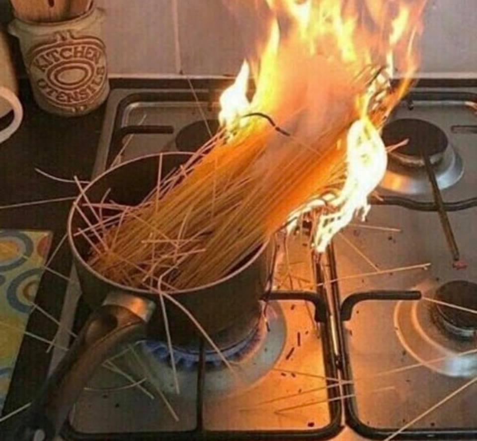

### Hi there 👋 This is a test for a markdown file on my profile

Here is a visual representation if my cooking skills were as good as my GitHub skills 
```{r,echo = FALSE,fig.align='center',out.width="60%"}

```

<!--
**larscaspersen/larscaspersen** is a ✨ _special_ ✨ repository because its `README.md` (this file) appears on your GitHub profile.

Here are some ideas to get you started:

- 🔭 I’m currently working on ...
- 🌱 I’m currently learning ...
- 👯 I’m looking to collaborate on ...
- 🤔 I’m looking for help with ...
- 💬 Ask me about ...
- 📫 How to reach me: ...
- 😄 Pronouns: ...
- ⚡ Fun fact: ...
-->
